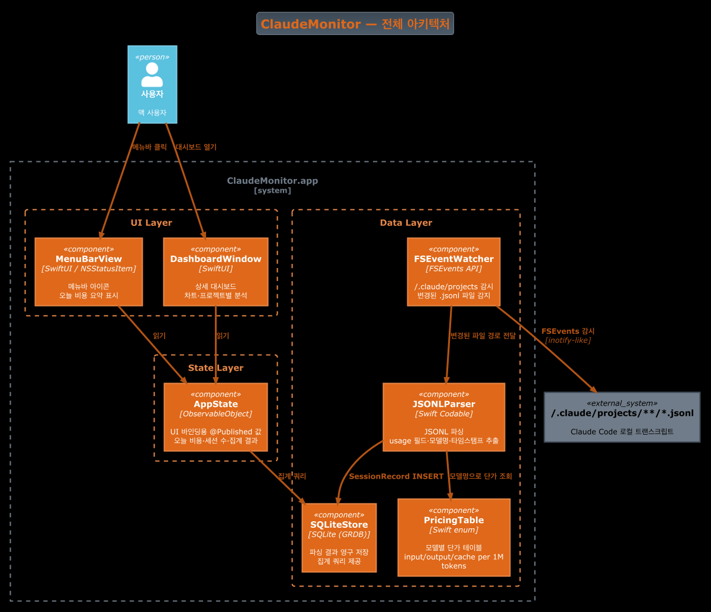
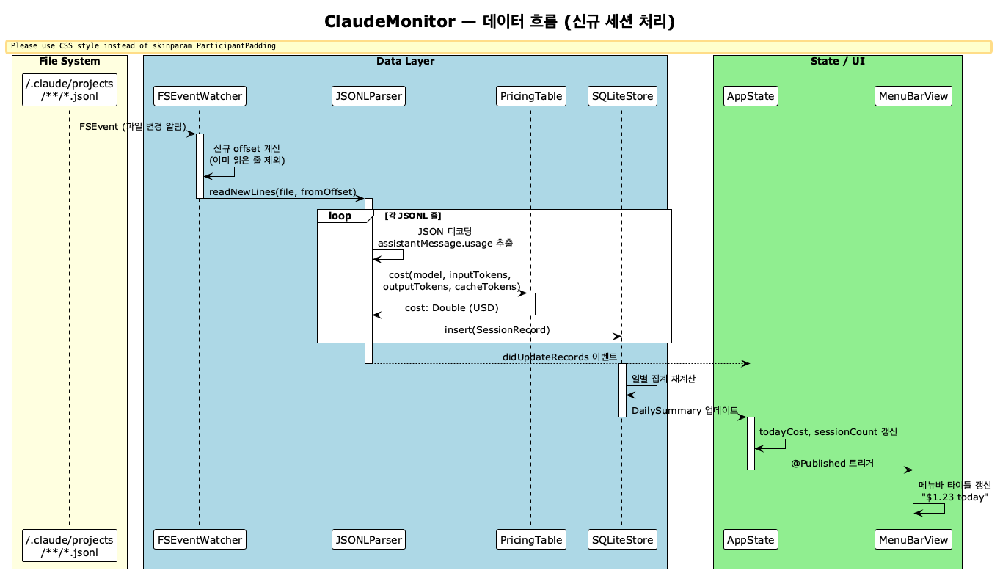
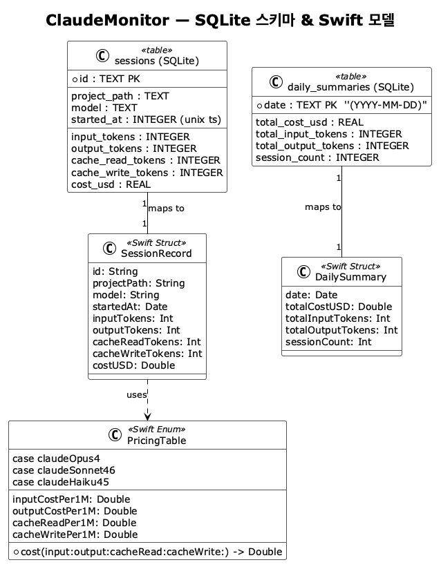

# ClaudeMonitor — 설계 문서

**작성일**: 2026-06-26  
**플랫폼**: macOS  
**스택**: Swift + SwiftUI, SQLite (GRDB), FSEvents

---

## 1. 개요

`~/.claude/projects/` 에 저장되는 Claude Code `.jsonl` 트랜스크립트를 실시간으로 파싱해 토큰 사용량과 비용을 추적하는 macOS 메뉴바 앱.

**핵심 목표**
- 오늘 사용한 Claude Code 비용을 메뉴바에서 즉시 확인
- 일/주/월별 비용 추이 및 프로젝트별 breakdown을 대시보드에서 분석
- 오프라인 동작 — API Key 불필요, 로컬 파일만 참조

---

## 2. 아키텍처



### 레이어 구성

| 레이어 | 구성 요소 | 역할 |
|--------|----------|------|
| UI | `MenuBarView`, `DashboardWindow` | 표시만 담당 |
| State | `AppState` (`ObservableObject`) | UI 바인딩, 레이어 간 중재 |
| Data | `FSEventWatcher` → `JSONLParser` → `SQLiteStore` | 수집·파싱·저장 |
| Config | `PricingTable` | 모델별 단가 상수 |

---

## 3. 데이터 흐름



1. `FSEventWatcher` 가 `~/.claude/projects/**/*.jsonl` 감시
2. 변경 감지 시 마지막으로 읽은 byte offset 이후만 파싱 (증분)
3. `JSONLParser` 가 각 줄에서 `usage` 필드 추출
4. `PricingTable` 로 모델별 단가 적용 → 비용 계산
5. `SQLiteStore` 에 `SessionRecord` INSERT
6. `AppState` 가 집계 쿼리 후 `@Published` 값 갱신 → UI 자동 리렌더

---

## 4. 데이터 모델



### JSONL 파싱 대상 필드

```json
{
  "type": "assistant",
  "message": {
    "model": "claude-sonnet-4-6",
    "usage": {
      "input_tokens": 1234,
      "output_tokens": 567,
      "cache_read_input_tokens": 890,
      "cache_creation_input_tokens": 100
    }
  },
  "timestamp": "2026-06-26T09:00:00.000Z"
}
```

### 모델 단가표 (PricingTable) — 2026-06 기준

| 모델 | Input | Output | Cache Read | Cache Write |
|------|-------|--------|------------|-------------|
| claude-opus-4-8 | $15 | $75 | $1.50 | $18.75 |
| claude-sonnet-4-6 | $3 | $15 | $0.30 | $3.75 |
| claude-haiku-4-5 | $0.80 | $4 | $0.08 | $1 |

*(단위: per 1M tokens)*  
⚠️ 단가는 Anthropic 공식 가격 기준이며 변경 시 `PricingTable.swift` 업데이트 필요

---

## 5. UI 구성

### 메뉴바
```
[●] $1.23 today  ▾
─────────────────────
  오늘: $1.23  |  847K tokens
  이번 주: $8.45
  ─────────────────
  대시보드 열기...
  종료
```

### 대시보드 윈도우 (SwiftUI NavigationSplitView)

```
┌──────────────────────────────────────────────────────┐
│  사이드바           │  메인 콘텐츠                    │
│  ─────────          │  ─────────────────────────────  │
│  ▸ 개요             │  [일별 비용 바 차트 - 30일]      │
│  ▸ 프로젝트별       │                                  │
│  ▸ 모델별           │  오늘 $1.23  /  이번달 $34.50    │
│  ▸ 토큰 상세        │  세션 수: 7  /  총 토큰: 2.1M    │
└──────────────────────────────────────────────────────┘
```

---

## 6. 프로젝트 구조

```
claude-monitor/
├── ClaudeMonitor/
│   ├── App/
│   │   ├── ClaudeMonitorApp.swift      # @main, NSStatusItem 초기화
│   │   └── AppState.swift              # ObservableObject, 앱 전역 상태
│   ├── MenuBar/
│   │   └── MenuBarView.swift           # NSStatusItem 콘텐츠
│   ├── Dashboard/
│   │   ├── DashboardView.swift         # NavigationSplitView 루트
│   │   ├── OverviewView.swift          # 일별 차트, 요약 카드
│   │   ├── ProjectBreakdownView.swift  # 프로젝트별 비용
│   │   └── TokenDetailView.swift       # 토큰 타입별 상세
│   ├── Data/
│   │   ├── FSEventWatcher.swift        # FSEvents 래퍼
│   │   ├── JSONLParser.swift           # Codable 모델 + 파싱 로직
│   │   ├── PricingTable.swift          # 모델별 단가 enum
│   │   └── SQLiteStore.swift           # GRDB 래퍼, 쿼리 메서드
│   └── Resources/
│       └── Assets.xcassets
├── docs/
│   ├── diagrams/                       # .puml 소스 + 렌더링 PNG
│   └── superpowers/specs/              # 이 파일
└── ClaudeMonitor.xcodeproj
```

---

## 7. 핵심 의존성

| 라이브러리 | 용도 | 추가 방법 |
|-----------|------|-----------|
| [GRDB.swift](https://github.com/groue/GRDB.swift) | SQLite ORM | Swift Package Manager |

FSEvents, SwiftUI, Charts — 모두 Apple 프레임워크, 추가 의존성 없음.

---

## 8. 구현 우선순위

| Phase | 목표 | 포함 기능 |
|-------|------|-----------|
| 1 | 핵심 동작 | FSEventWatcher + JSONLParser + SQLite + 메뉴바 비용 표시 |
| 2 | 대시보드 | 일별 차트, 프로젝트별 breakdown |
| 3 | 사용 패턴 | 모델별 분석, 토큰 타입 상세, 세션 히스토리 |

---

## 9. 미결 사항

- [ ] Xcode 프로젝트 생성 (SPM 설정 포함)
- [ ] `.jsonl` 포맷 정확한 스키마 확인 (실제 파일 샘플 파싱 테스트 필요)
- [ ] 앱 샌드박스 설정 — `~/.claude` 접근 권한 (`com.apple.security.files.user-selected.read-only` 또는 bookmark)
- [ ] 단가표 업데이트 전략 (하드코딩 vs 원격 fetch)
